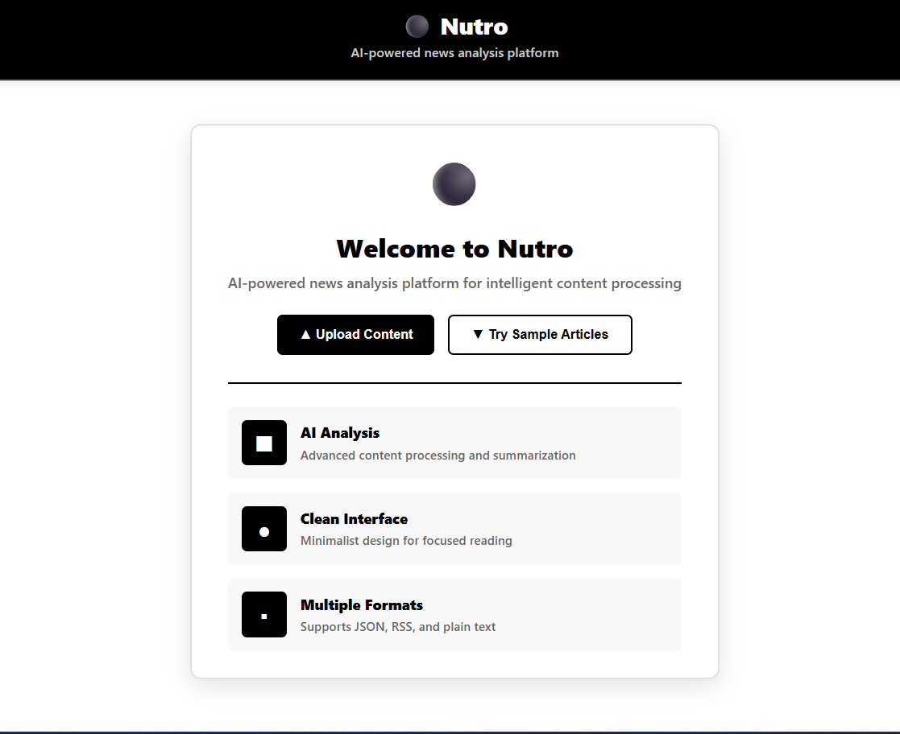
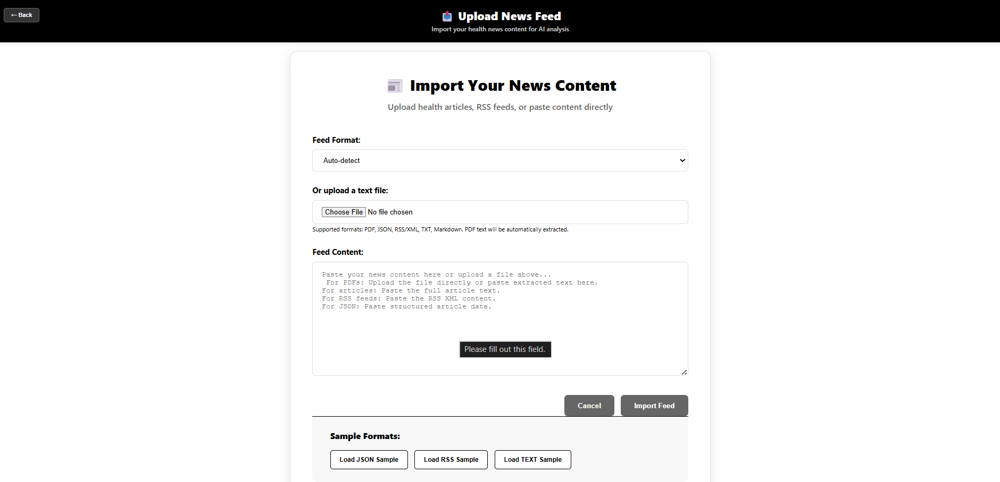
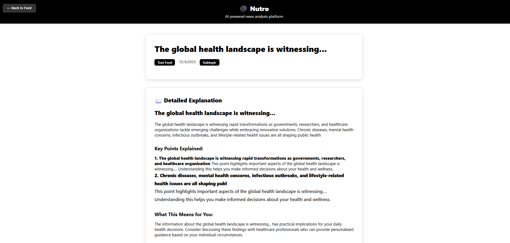
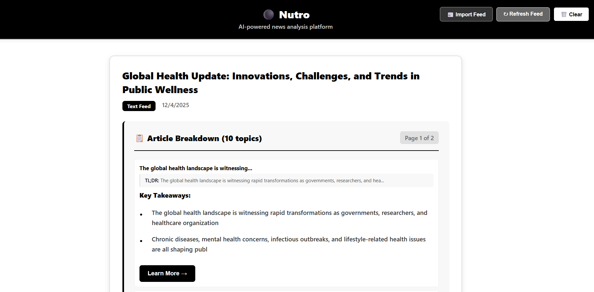
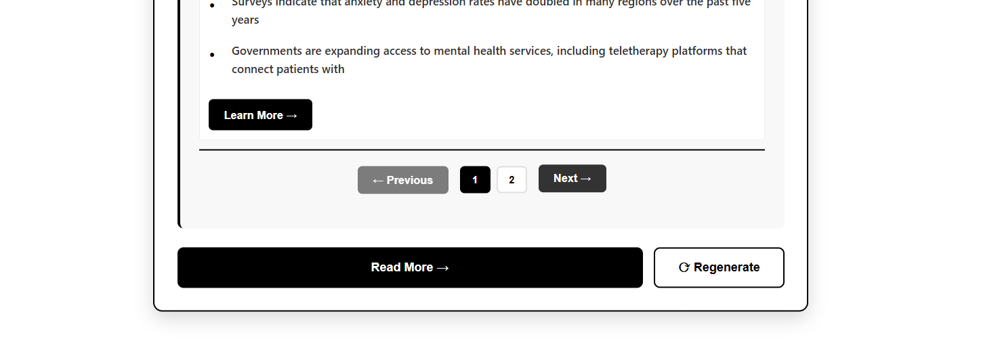

# Nutro Frontend - React Application

This is the frontend React application for the Nutro AI News Analysis Platform.

## 🚀 Quick Start

1. **Install dependencies:**
   ```bash
   npm install
   ```

2. **Configure environment:**
   ```bash
   cp .env.example .env
   # Edit .env with your Gemini API key
   ```

3. **Start development server:**
   ```bash
   npm start
   ```

## 📱 Application Screenshots

### Welcome Screen

*Clean welcome screen with feature showcase*

### Content Upload

*Easy content import and processing*

### Article Analysis

*AI-powered article breakdown*

### Key Insights

*Structured takeaways and insights*

### Smart Navigation

*Advanced pagination controls*

## 🔧 Environment Variables

| Variable | Required | Description |
|----------|----------|-------------|
| `REACT_APP_GEMINI_API_KEY` | Yes | Your Gemini AI API key |
| `REACT_APP_GEMINI_BASE_URL` | No | Gemini API base URL |
| `REACT_APP_APP_NAME` | No | Application name |
| `REACT_APP_DEBUG_MODE` | No | Enable debug logging |

## 🛠️ Available Scripts

- `npm start` - Start development server
- `npm run build` - Build for production
- `npm test` - Run tests (when available)
- `npm run eject` - Eject from Create React App

## 📚 Documentation

For complete documentation, see the [main README](../README.md) in the project root.

## 🎨 Features

- **AI Analysis**: Powered by Google Gemini AI
- **Black & White Theme**: Clean, minimalist design
- **Responsive Design**: Works on all devices
- **Smart Pagination**: Enhanced navigation controls
- **Real-time Processing**: Dynamic content analysis

## 🔗 Project Structure

```
src/
├── components/          # React components
│   ├── Header.jsx       # Navigation header
│   ├── WelcomeScreen.jsx # Landing page
│   ├── ArticleFeed.jsx  # Article listing
│   ├── ArticleCard.jsx  # Individual articles
│   ├── Pagination.jsx   # Navigation controls
│   └── index.js         # Component exports
├── aiService.js         # AI API integration
├── feedParser.js        # Content parsing
├── mockData.js          # Sample data
├── App.js               # Main application
└── App.css              # Styling
```

## 🚨 Troubleshooting

- **API Key Issues**: Check your `.env` file configuration
- **Build Errors**: Ensure Node.js 16+ is installed
- **Performance**: Check browser developer tools for errors

For more help, see the [main documentation](../README.md).